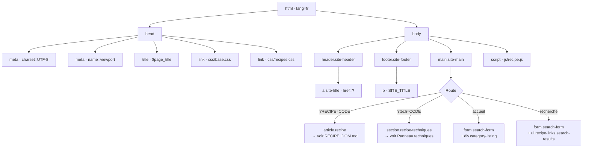
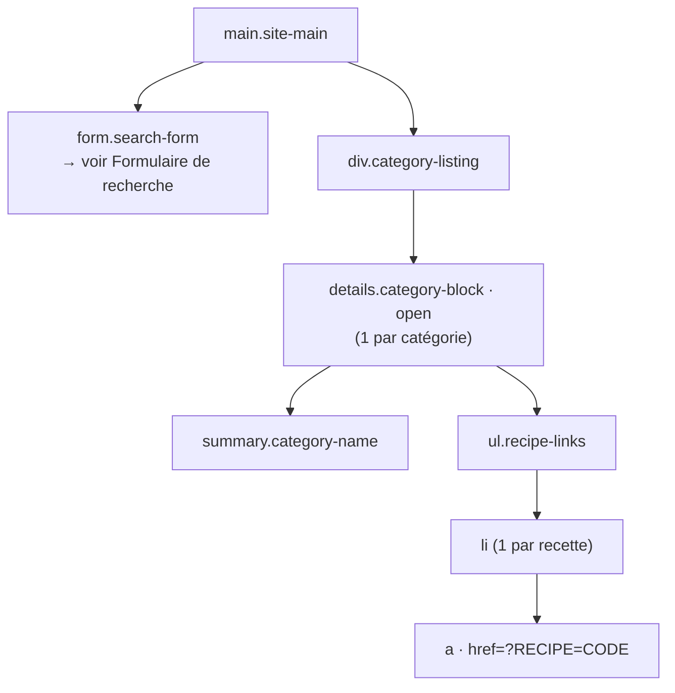
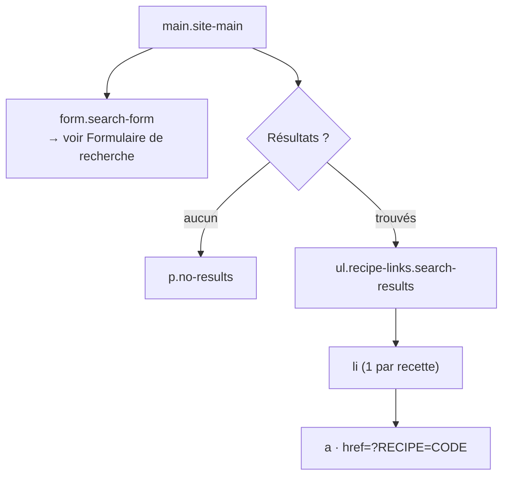
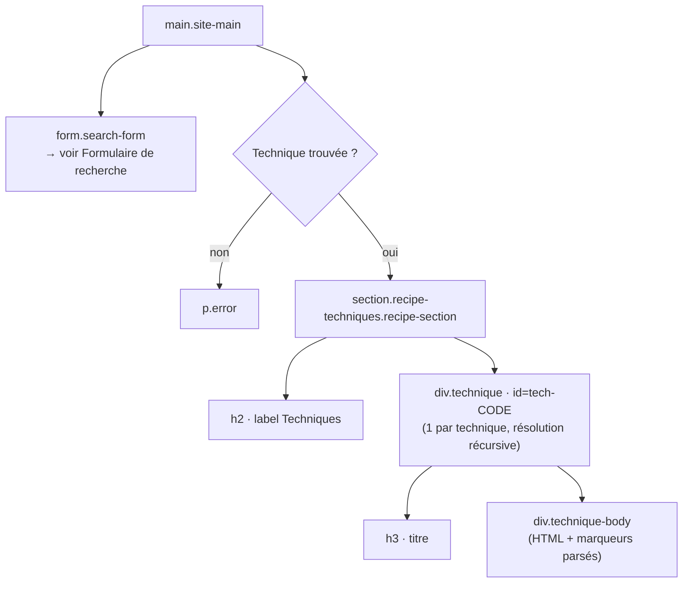
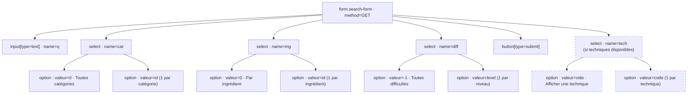

# DOM — Page principale (`index.php`)

La page principale gère trois routes selon les paramètres GET reçus.
Les éléments en pointillés sont conditionnels ou optionnels.

---

## Squelette HTML (mode standalone)

> En mode intégré (`recipe_integration.lib.php` présent), `recipe_header()` / `recipe_body()` /
> `recipe_footer()` du site hôte enveloppent le contenu à la place du squelette ci-dessous.

---

## Route accueil — listing par catégorie

Affiché quand aucun filtre de recherche n'est actif.

---

## Route recherche — résultats

Affiché quand au moins un filtre est actif (`q`, `cat`, `ing` ou `diff`).

---

## Route technique — `?tech=CODE`

Affiche une technique isolée (sans fiche recette).

---

## Formulaire de recherche (`form.search-form`)

Présent dans toutes les routes de la page principale.

