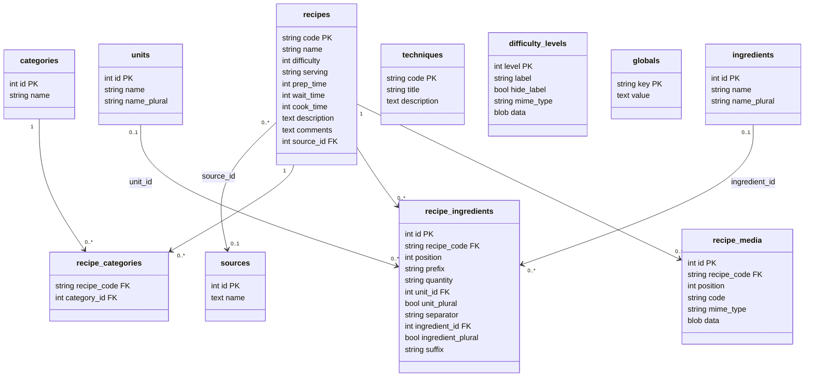

# PBRecipe

Recipe manager (cooking, cocktails…) with export to a standalone PHP website
or as an inclusion into a larger PHP site.

Recipes are stored in a local database (SQLite) or a shared one
(MariaDB, PostgreSQL). The application generates a complete PHP website ready to
deploy on a standard web hosting service.

Full documentation: [pbrecipe.readthedocs.io](https://pbrecipe.readthedocs.io)

## Features

- Recipe editing with rich HTML descriptions (headings, lists, links, images).
- Instant recipe list filter, case- and accent-insensitive.
- Spell and grammar checking (Grammalecte or LanguageTool, F7).
- Reference management: categories, ingredients, units, sources, techniques,
  difficulty levels (with icon).
- Dynamic markers in text: `[RECIPE:code]`, `[IMG:code]`, `[TECH:code]`.
- YAML import/export (portable backup of the entire database).
- PHP export: generates a static + dynamic website deployable on Apache/Nginx + PHP + PDO.
- Interface in French.

## Installation

### From pre-built executables (recommended)

Download the executable for your system from the
[Releases](https://github.com/ppoilbarbe/PBRecipe/releases) page:

| System        | File                     |
|---------------|--------------------------|
| Linux (x86-64)| `pbrecipe`               |
| Windows       | `pbrecipe.exe`           |
| macOS         | `PBRecipe.app.zip`       |

**Linux / macOS**
```bash
chmod +x pbrecipe
./pbrecipe
```

**Windows**: double-click `pbrecipe.exe`.

**macOS**: unzip the archive and move `PBRecipe.app` to `/Applications`.
On first launch, allow the application in
*Réglages système → Confidentialité et sécurité*.

> Executables are self-contained — no Python or third-party library required.

### From source (developers)

Prerequisites: [Conda](https://docs.conda.io/) (Miniforge recommended).

```bash
git clone https://github.com/ppoilbarbe/PBRecipe.git
cd PBRecipe
make venv      # creates the conda environment 'pbrecipe'
make install   # installs the package in editable mode + git hooks
make run       # launches the application
```

## Usage

```
pbrecipe [FILE] [OPTIONS]
```

| Argument / Option          | Description                                              |
|----------------------------|----------------------------------------------------------|
| `FILE`                     | `.yaml` configuration file to open at startup           |
| `--export-php [DIRECTORY]` | PHP export without graphical interface                   |
| `--debug` / `--quiet`      | Log level (DEBUG / WARNING)                              |

On first launch, create a new database via **Fichier → Nouvelle base…**.

## Database schema



## Development

### System prerequisites

In addition to Conda, the following tools must be installed at the system level:

```bash
# PHP coverage (Xdebug for the system PHP)
sudo apt install php-xdebug php-xml php-sqlite3   # Ubuntu/Debian
```

> **Why at the system level?** The PHP bundled in the conda environment
> (`conda-forge`, currently 8.5) is not yet supported by Xdebug or PCOV.
> `make coverage` automatically falls back to the system PHP (8.3) when the conda
> PHP has no coverage driver. Without these packages, PHP coverage is skipped
> (tests still run; this is the normal CI behaviour).
>
> `php-sqlite3` is required because the PHP tests use a SQLite database; without
> this package, PHPUnit is killed by a `die()` in `db.php` before writing the report.

### Code coverage

```bash
make coverage   # Python report → htmlcov/index.html
                # PHP report    → htmlcov/php/index.html (if Xdebug available)
```

The target automatically detects the available PHP coverage driver:

| Situation | Behaviour |
|---|---|
| conda PHP + Xdebug/PCOV | Coverage via conda (optimal) |
| system PHP + Xdebug | Coverage via system PHP (current fallback) |
| No driver | PHP tests run without coverage + warning |

### Future migration — Xdebug/PCOV in conda

When Xdebug or PCOV support PHP 8.5 and become available in conda-forge,
install the package in the environment and simplify the `coverage` Makefile target:
remove the `elif`/`else` branches and keep only the
`$(CONDA_RUN) ./vendor/bin/phpunit --coverage-html htmlcov/php` invocation. The
comment in the Makefile notes exactly this point.

## License

GNU GPL v3 — see [LICENSE](LICENSE).
Third-party component licenses: see [LICENSES](LICENSES).
