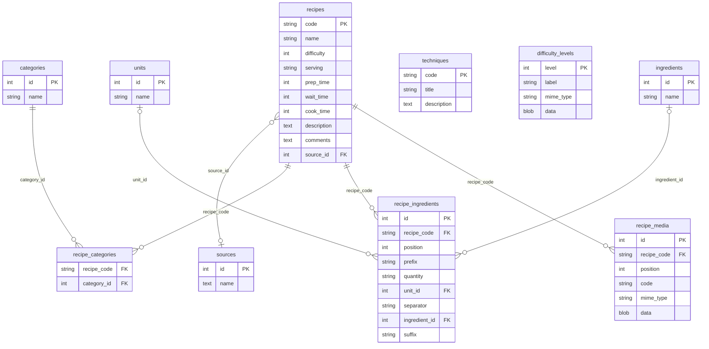

# PBRecipe

Gestionnaire de recettes (cuisine, cocktails…) avec export vers un site PHP
autonome ou en inclusion dans un site PHP plus large.

Les recettes sont stockées dans une base de données locale (SQLite) ou partagée
(MariaDB, PostgreSQL). L'application génère un site PHP complet prêt à déployer
sur un hébergement web standard.

## Fonctionnalités

- Saisie des recettes avec description HTML enrichie (titres, listes, liens, images).
- Gestion des référentiels : catégories, ingrédients, unités, sources, techniques,
  niveaux de difficulté (avec icône).
- Marqueurs dynamiques dans les textes : `[RECIPE:code]`, `[IMG:code]`, `[TECH:code]`.
- Import / export YAML (sauvegarde portable de toute la base).
- Export PHP : génère un site statique + dynamique déployable sur Apache/Nginx + PHP + PDO.
- Interface en français.

## Installation

### Depuis les exécutables précompilés (recommandé)

Téléchargez l'exécutable correspondant à votre système depuis la page
[Releases](https://github.com/ppoilbarbe/PBRecipe/releases) :

| Système       | Fichier                  |
|---------------|--------------------------|
| Linux (x86-64)| `pbrecipe`               |
| Windows       | `pbrecipe.exe`           |
| macOS         | `PBRecipe.app.zip`       |

**Linux / macOS**
```bash
chmod +x pbrecipe
./pbrecipe
```

**Windows** : double-cliquez sur `pbrecipe.exe`.

**macOS** : décompressez l'archive et déplacez `PBRecipe.app` dans `/Applications`.
Lors du premier lancement, autorisez l'application dans
*Réglages système → Confidentialité et sécurité*.

> Les exécutables sont autonomes — aucun Python ni bibliothèque tierce à installer.

### Depuis les sources (développeurs)

Prérequis : [Conda](https://docs.conda.io/) (Miniforge recommandé).

```bash
git clone https://github.com/ppoilbarbe/PBRecipe.git
cd PBRecipe
make venv      # crée l'environnement conda 'pbrecipe'
make install   # installe le paquet en mode éditable + git hooks
make run       # lance l'application
```

## Utilisation

```
pbrecipe [FICHIER] [OPTIONS]
```

| Argument / Option          | Description                                              |
|----------------------------|----------------------------------------------------------|
| `FICHIER`                  | Fichier de configuration `.yaml` à ouvrir au démarrage  |
| `--export-php [RÉPERTOIRE]`| Export PHP sans interface graphique                      |
| `--debug` / `--quiet`      | Niveau de journalisation (DEBUG / WARNING)               |

Au premier lancement, créez une nouvelle base via **Fichier → Nouvelle base…**.

## Schéma de la base de données



## Licence

GNU GPL v3 — voir [LICENSE](LICENSE).
Licences des composants tiers : voir [LICENSES](LICENSES).
