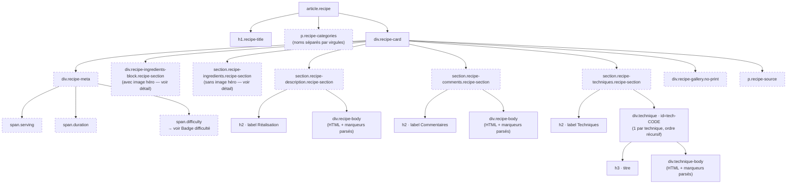
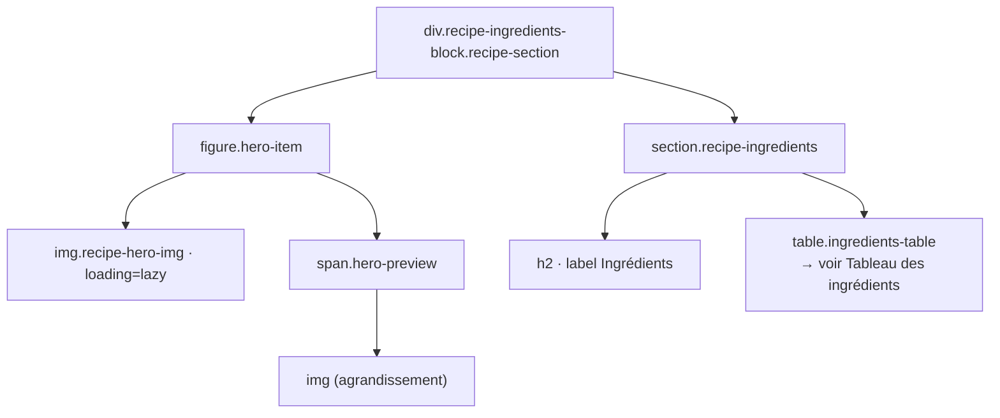
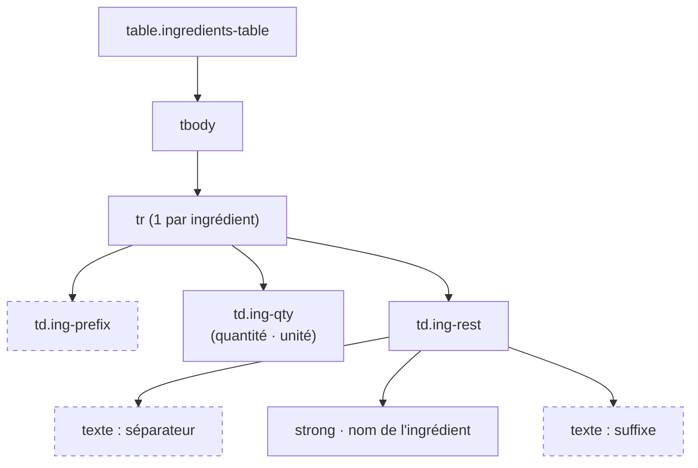
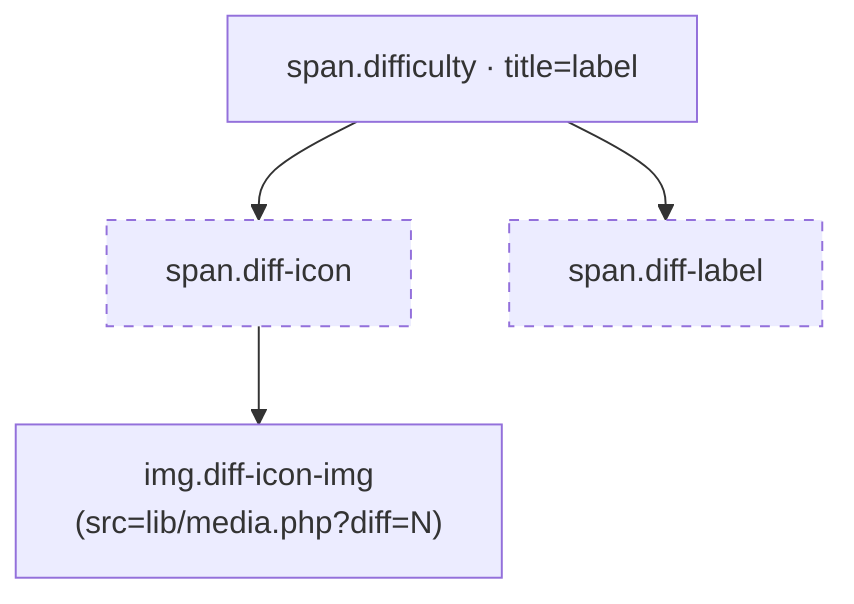
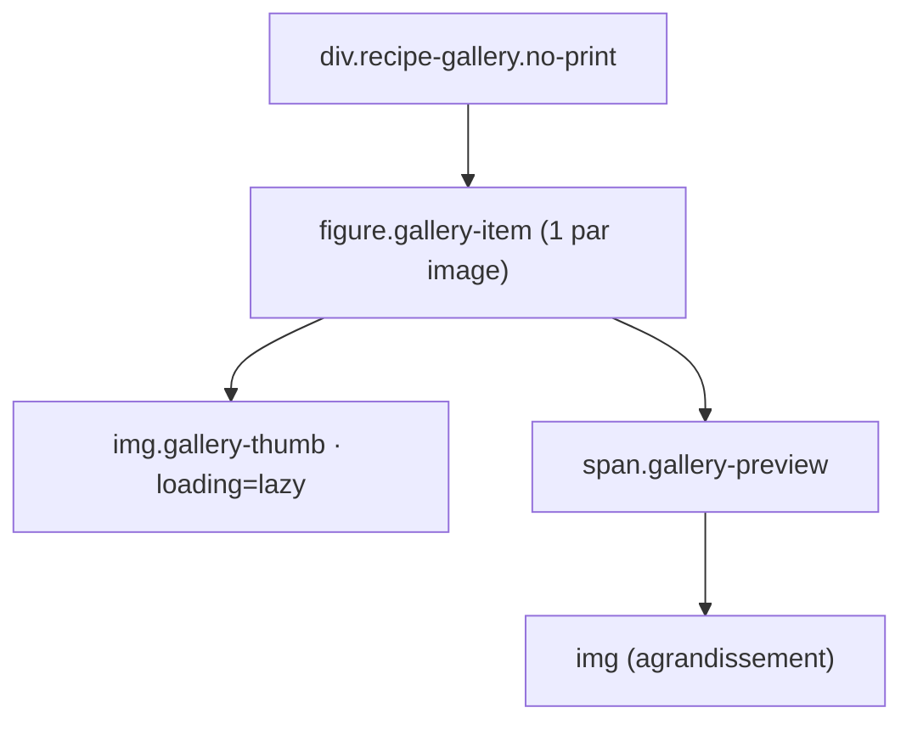
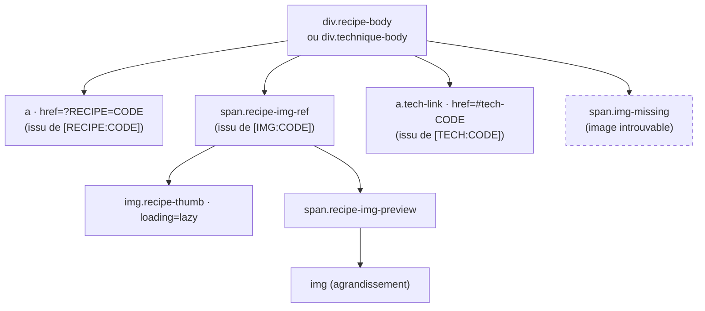

# DOM — Fiche recette (`?RECIPE=CODE`)

Structure HTML produite par `render_recipe()` dans `lib/display.php`.
Les éléments en pointillés sont conditionnels (absents si la donnée est vide).

---

## Structure générale

---

## Bloc ingrédients avec image héro

Rendu quand la recette a au moins un ingrédient **et** au moins une image.
L'image héro est la première image déclarée dans les médias de la recette.

---

## Tableau des ingrédients

Rendu identiquement que l'image héro soit présente ou non.
La colonne `ing-prefix` n'est incluse que si au moins un ingrédient porte un préfixe.

---

## Badge difficulté (`span.difficulty`)

---

## Galerie d'images (`div.recipe-gallery`)

Images restantes après l'image héro. Non imprimée (`no-print`).

---

## Marqueurs parsés dans `recipe-body` / `technique-body`

`parse_markers()` transforme trois types de marqueurs présents dans le HTML riche.

